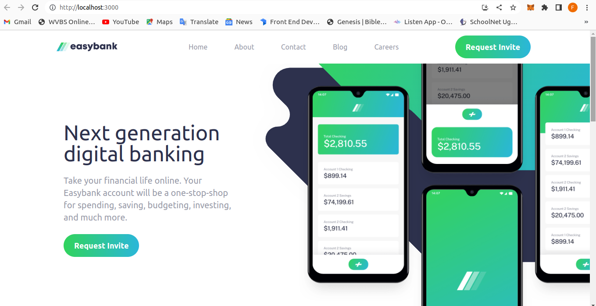
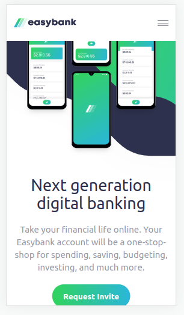

# Frontend Mentor - Easybank landing page solution

This is a solution to the [Easybank landing page challenge on Frontend Mentor](https://www.frontendmentor.io/challenges/easybank-landing-page-WaUhkoDN). Frontend Mentor challenges help you improve your coding skills by building realistic projects. 

## Table of contents

- [Overview](#overview)
  - [The challenge](#the-challenge)
  - [Screenshot](#screenshot)
  - [Links](#links)
- [My process](#my-process)
  - [Built with](#built-with)
  - [Continued development](#continued-development)
- [Author](#author)

## Overview

I built a landing page for essayBank using React.js and Tailwind CSS. React.js is a JavaScript library for creating user interfaces, while Tailwind CSS is a utility-first CSS framework. The landing page aims to attract visitors and encourage specific actions. I designed the layout using Tailwind CSS utility classes and created reusable React components for different sections. The page is responsive, thanks to Tailwind CSS's responsive utility classes.Finally, i deployed the landing page to make it accessible online.

### The challenge

Users should be able to:

- View the optimal layout for the site depending on their device's screen size
- See hover states for all interactive elements on the page

### Screenshot

### Links

- Solution URL: [Add solution URL here](https://your-solution-url.com)
- Live Site URL: [Add live site URL here](https://your-live-site-url.com)

### Built with

- Flexbox
- Mobile-first workflow
- [React](https://reactjs.org/) - JS library
- [TailwindCss](https://tailwindcss.com/) - For styles

### Continued development

 - Redux state management
 - blockchain

## Author

- Frontend Mentor - [Fred Zabulon](https://www.frontendmentor.io/profile/fredzabu)
- Twitter - [@FredZabulon](https://twitter.com/FredZabulon)

